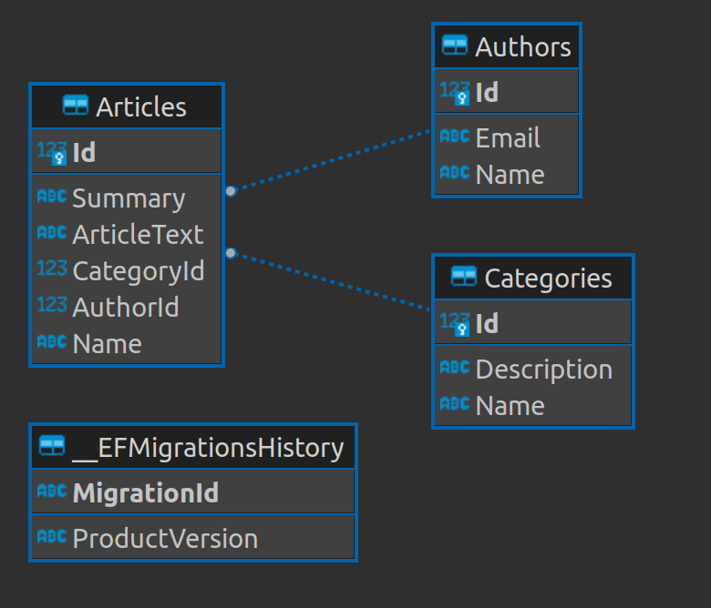
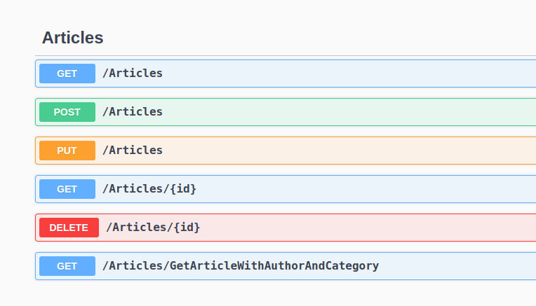

# ArticleApp-Project

---

## Proje Hakkında Bilgiler

* Projede kullanılması için 14334 portunda bir MsSql imajı ile Docker container ayağa kaldırılmıştır ve proje esnasında kullanılmıştır.
* Projede ilerleyen süreçlerde başka clientlarda kullanabilme ihtimaline karşı bütün backend projesinin tekrar yazılmaması için Asp.Net Core WebApi projesi oluşturularak WebUI katmanının Api ile haberleşmesi sağlanmıştır.
* Projede bütün api metotları güvenlik için DTO nesneleri ile request ve response işlemelerini gerçekleştirmektedir. Bu işlem için AutoMapper kütüphanesi kullanılmıştır.
* Entity konfigürasyonu Fluent Api ile yapılmıştır.
* Hataların yönetilmesi için Custom Exception middleware'ı yazılmıştır ve custom exception sınıfları yazılmıştır. 
* Repository Design Pattern, UnitOfWork Design Pattern gibi design patternler proje içerisinde kullanılmıştır.
* Dependency Injection için AutoFac kütüphanesi kullanılmıştır.
* Her defasına database'e sorguların gitmemesi için INMemory Caching kullanılmıştır. Cache değiştiği zaman(Delete, Update, Insert) tekrar verilere ait cache alınarak bayat cache oluşması önlenmiştir.
* API'lar bütün endpoint testleri swagger ve postmen kullanılarak yapılmıştır. 

## Database Şeması



## Projede Kullanılan API'lar



## Connection String

Database'e bağlanmak için gereken connection string içinde yer alan kullanıcı adı ve şifre User-Secret ile oluşturulmuştur.

`dotnet user-secrets init`

`dotnet user-secrets set "uid" "sa"`

`dotnet user-secrets set "Password" "p55w0rd!"`

```json

{
  "UserId": "sa",
  "Password": "p55w0rd!"
}

```

## Database migration işlemleri

Migrations Ekleme

`dotnet ef migrations add "InitialCreate" --project ArticleApp.Repository/ --startup-project ArticleApp.API/`

Database Güncelleme

`dotnet ef database update --project ArticleApp.Repository/ --startup-project ArticleApp.API/`

## Sorular ve Cevapları

---

### - Projede kullandığınız tasarım desenleri hangileridir? Bu desenleri neden kullandınız?

Bu projede Generic Repository Design Pattern ve Unit of Work Design Pattern kullandım. Generic Repository Design Pattern kullanmamın sebebi yapılan CRUD işlemlerinin sürekli tekrar oluşturması ve sonucunda SOLID kurallarına aykırı bir davranış sergilememek için. Unit of Work Design Pattern ise yapılan değişiklikler için yazılımın her defasında database'e gitmesini engellemek ve bu kararı yazılımcıya bırakarak daha az maliyetle geliştirme yapmamızı sağladığı için kullanılmıştır.

### - Kullandığınız teknoloji ve kütüphaneler hakkında daha önce tecrübeniz oldu mu? Tek tek yazabilir misiniz?

Okulda ki projelerimde ve bireysel yaptığım projelerde bu proje kapsamında kullandığım teknoloji ve kütüphaneler hakkında tecrübem oldu.

### - Daha geniş vaktiniz olsaydı projeye neler eklemek isterdiniz?

Dotnet Identity kütüphanesi ile Identity veya JWT kullanılarak kullanıcı bazlı doğrulama işlemleri yapılabilirdi. Login ve Sign Up sayfaları eklenebilirdi.